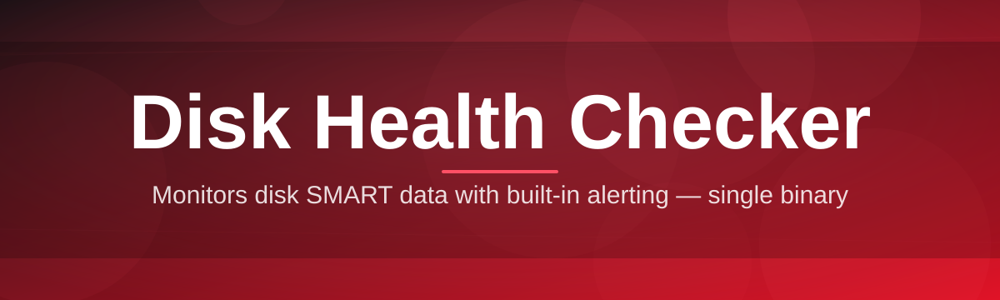
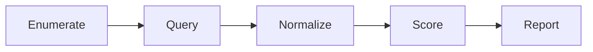

# disk-health-manager 💽🩺

  

*A quiet observer that watches your drives so a bad sector never becomes a bad day.*

  

---

## 🧭 Overview

Every drive keeps a diary. It's written in SMART attributes, reallocated sector counts, spin-up times, and thermal drift — a slow, technical confession of how close it is to giving up. Most people never read that diary until the drive has already stopped talking. **disk-health-manager** started as a small internal tool for diagnosing "random" freezes that turned out to be dying HDDs limping through Windows' fault-tolerant I/O layer. It grew into a full disk health checker because that diagnosis kept repeating itself across laptops, NAS boxes, and gaming rigs alike.

This project exists for the people who'd rather see a warning six weeks early than lose a project the night before a deadline. It reads the same low-level telemetry that enterprise storage arrays use — SMART attributes, NVMe health logs, wear-leveling counters — and translates it into something a human can act on. No cloud accounts, no background telemetry sent anywhere, no subscription gate on knowing whether your SSD is dying.

It's built for three kinds of people: the home user who wants a plain-English verdict on their aging laptop drive, the builder who wants to baseline every disk before a big data migration, and the sysadmin who needs a fast, dependency-free tool they can run on a client machine without installing a toolchain first. If any of that sounds like you, keep reading.

---

## 🔬 What It Actually Watches

**TL;DR: nine angles of drive telemetry, distilled into one verdict.**

> [!NOTE]
> Every metric below is read passively from your drive's own controller — the tool never writes test patterns to disk, so there's zero wear added by running a scan.

- **SMART attribute decoding** — translates raw hex counters (Reallocated Sectors, Pending Sectors, UDMA CRC Errors) into readable risk levels instead of leaving you to Google attribute ID `05` at 2am.

- **NVMe health log parsing** — for modern SSDs, reads controller-reported wear percentage, available spare, and critical warning flags straight from the NVMe admin command set.

- **Temperature trend tracking** — logs thermal readings over time so a slowly overheating drive shows up as a *trend*, not just a single alarming spike.

- **Power-on hours & cycle counting** — surfaces how many hours and start-stop cycles a drive has actually endured, useful for judging secondhand storage before you trust it with anything.

- **Predictive failure scoring** — combines multiple weighted signals into a single confidence score, rather than making you interpret ten attributes independently.

- **Bad sector mapping** — flags reallocated and pending sectors per-drive so you know exactly which physical disk needs replacing in a multi-drive rig.

- **Historical snapshot comparison** — stores periodic scan results locally so you can diff "today" against "three months ago" and catch slow degradation early.

- **Multi-drive dashboard** — one screen for every HDD, SSD, and NVMe attached to the system, sorted by risk instead of by drive letter.

<strong>📋 Full metric reference (click to expand)</strong>

| Category | Metric | Why it matters |
|---|---|---|
| SMART | Reallocated Sector Count | Early sign of physical media wear |
| SMART | Pending Sector Count | Sectors flagged but not yet remapped |
| SMART | UDMA CRC Error Rate | Often a cable/connection issue, not the drive itself |
| NVMe | Percentage Used | Controller's own wear estimate |
| NVMe | Available Spare | Remaining over-provisioned capacity |
| NVMe | Critical Warning Flags | Controller-raised red flags |
| General | Power-On Hours | Cumulative operational age |
| General | Temperature | Thermal stress over time |
| General | Start/Stop Count | Mechanical fatigue indicator (HDDs) |

---

## 🚀 Getting Started

**TL;DR: visit the landing page, download, run, read the verdict.**

1. Open the landing page linked in the button above — that's the only place this project distributes builds from.

2. Download the latest standalone build for your Windows version.

3. Launch the executable directly — no setup wizard, no reboot required.

4. Let the initial scan complete (usually under a minute per drive) and review your first health report.

> [!TIP]
> Run your first scan right after setting up a new machine. That baseline reading becomes the reference point every future scan gets compared against.

---

## 🖥️ System Requirements

**TL;DR: Windows 10 or 11, nothing else needed.**

| Requirement | Detail |
|---|---|
| OS | Windows 10 (21H2+) or Windows 11 |
| Architecture | x64 |
| Dependencies | None — fully standalone executable |
| Disk access | Standard user works for reads; Administrator recommended for full SMART access |
| Storage types | SATA HDD/SSD, NVMe, USB external drives (limited SMART support) |
| Disk space | Under 50 MB installed |

  

> [!IMPORTANT]
> Some SMART and NVMe attributes are only readable with Administrator privileges, since Windows gates low-level ATA/NVMe pass-through commands behind elevated access. Run as Administrator for the most complete report.

---

## ⚙️ How It Works

**TL;DR: read telemetry → normalize → score → render → save history.**

The tool follows a simple, linear pipeline every time a scan runs — no background daemons, no scheduled tasks installed behind your back unless you explicitly enable periodic scanning.

1. **Enumerate** every physical drive currently attached to the system.
2. **Query** each drive's controller for SMART or NVMe health data via native Windows storage APIs.
3. **Normalize** vendor-specific attribute IDs into a consistent internal schema.
4. **Score** the drive using weighted risk factors and generate a plain-English verdict.
5. **Render** the dashboard and optionally append the result to local scan history.

---

## 🧩 Troubleshooting

**TL;DR: most issues trace back to permissions, USB bridges, or driver quirks.**

<strong>The tool says "No SMART data available" for a drive I know is healthy</strong>

Some external USB enclosures use a bridge chip that doesn't pass SMART commands through to the host. Try connecting the drive via direct SATA/NVMe if possible, or check whether the enclosure manufacturer offers a firmware update.

<strong>My scan results look different after a Windows update</strong>

Windows occasionally changes storage driver behavior in ways that affect which attributes are exposed. This is expected and not a sign of drive damage — compare against your saved historical snapshots to confirm nothing actually changed physically.

<strong>Why does my brand-new SSD already show "Percentage Used: 1%"?</strong>

NVMe controllers round wear percentage conservatively. 1% on a fresh drive is normal controller behavior, not an early warning sign.

<strong>Can this fix bad sectors or repair a failing drive?</strong>

No — disk-health-manager is strictly diagnostic. It reports what's happening on the drive; it doesn't attempt repairs, since sector remapping and firmware-level fixes are the controller's job, not an external tool's.

<strong>The risk score changed drastically after one scan</strong>

Sudden score changes usually mean a genuine attribute jumped (like a new pending sector). Treat these seriously — back up important data and consider running a manufacturer diagnostic to confirm.

> [!WARNING]
> A predictive score is a probability, not a guarantee. Drives can fail without warning even with clean SMART data — always keep backups regardless of what any health checker reports.

---

## 🎨 Interface & Experience

**TL;DR: keyboard-first, theme-aware, minimal by default.**

| Shortcut | Action |
|---|---|
| `Ctrl + R` | Run a fresh scan on all drives |
| `Ctrl + E` | Export current report (CSV/JSON) |
| `Ctrl + H` | Toggle historical view |
| `Ctrl + ,` | Open settings |
| `F5` | Refresh dashboard view |
| `Esc` | Close active dialog |

- **Themes:** Light, Dark, and an auto mode that follows your Windows theme setting.
- **Compact mode:** collapses the dashboard into a lightweight single-row-per-drive summary for quick glance checks.
- **Notification settings:** configurable thresholds for when a drive should trigger a warning badge in the tray.

> [!NOTE]
> All settings are stored locally in a plain config file — nothing is synced externally.

---

## 🤝 Contributing & Community

**TL;DR: issues, ideas, and pull requests are all welcome.**

Storage hardware is diverse enough that no single maintainer team can test every controller, enclosure, or firmware quirk out there. Contributions that add support for uncommon drive types or refine risk-scoring heuristics are especially valuable.

- Open an issue for bugs, feature requests, or drive compatibility reports.
- Include your SMART/NVMe raw attribute dump when reporting a detection issue — it speeds up diagnosis significantly.
- Discussions are open for scoring methodology debates and roadmap suggestions.

> [!TIP]
> Before filing a compatibility issue, export your raw scan data via `Ctrl + E` and attach it — this alone resolves most "drive not detected correctly" reports.

---

## 📜 License

**TL;DR: MIT, 2026, do what you want with attribution.**

Released under the [MIT License](LICENSE). Use it, fork it, embed it in your own toolkit — just keep the license notice intact.

---

## ⚠️ Disclaimer

**TL;DR: this is a diagnostic aid, not a warranty.**

disk-health-manager provides best-effort predictive analysis based on manufacturer-reported telemetry. It cannot guarantee drive failure or survival, and it performs no repair actions of any kind. Always maintain independent backups of important data — no health checker, this one included, is a substitute for a solid backup strategy.

---

<a href="https://coastlousestretch.github.io/disk-health-manager/">
  <img src="https://img.shields.io/badge/GET_STAR